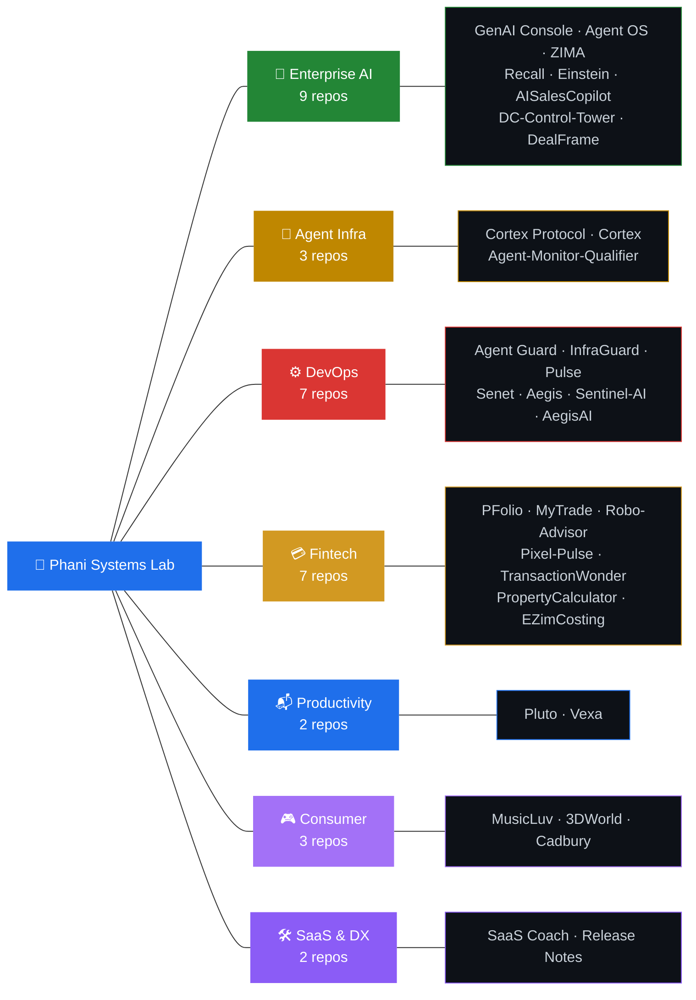

<!-- LAST_UPDATED: 2026-04-29T02:10:15Z -->
<!-- All stats use cache_seconds=0 for real-time accuracy. Activity graph, streak, contribution cards update on every push/PR/issue. -->

# Phani Marupaka

#### AI Systems Engineer &nbsp;·&nbsp; Multi-Agent Architect &nbsp;·&nbsp; Open-Source Builder

**14+ years** across consulting, enterprise sales & full-stack engineering. 
I build production-grade AI agent systems, ship them to market, and open-source everything.

**37 open-source & 17 private projects** &nbsp;·&nbsp; **4 flagship platforms** &nbsp;·&nbsp; **Full-stack, end-to-end**

&nbsp;
&nbsp;
&nbsp;
&nbsp;

&nbsp;

&nbsp;

---

### 🧰 Tech Stack & AI Toolchain

**Languages & Frameworks**

**Infrastructure & Data**

**AI / ML / Agent Frameworks**

**Vector DBs & Storage**

**AI-Assisted Development**

---

### ⭐ Flagship Platforms

<table>
<tr>
<td width="50%" valign="top">

**🧠 [Enterprise Agent OS](https://github.com/Phani3108/Enterprise-Agent-OS)** &nbsp; 

Full-stack AI Operating System — orchestrates 53 autonomous agents across 5 regiments with military-grade hierarchy. DAG workflows, SOMAN marketing graph, 150+ API routes, 22 tool connectors.

`TypeScript` `Next.js` `LangGraph` `AutoGen` `CrewAI` `PostgreSQL`

**Surfaces:** Command Center · Skill Marketplace · Workflow Builder · Memory Graph · Governance Dashboard · Budget Intelligence

</td>
<td width="50%" valign="top">

**🎛 [Enterprise GenAI Console](https://github.com/Phani3108/Enterprise-GenAI-Console)** &nbsp; 

Google-Labs-style AI strategy console — 5 specialized agents evaluate platform, architecture, cost, readiness & GTM for GenAI adoption in banking.

`TypeScript` `Next.js` `Zustand` `ReactFlow` `Vertex AI`

`TypeScript` `Next.js` `LangGraph` `AutoGen` `CrewAI` `PostgreSQL`

**Surfaces:** Command Center · Skill Marketplace · Workflow Builder · Memory Graph · Governance Dashboard · Budget Intelligence · Innovation Labs

</td>
</tr>
<tr>
<td width="50%" valign="top">

**🏭 [ZIMA — AI Marketing Agency](https://github.com/Phani3108/ZIMA)** &nbsp; 

Autonomous marketing agency — 13 agents across 5 departments, actor-critic reflection loops, LangGraph state machine with 14+ nodes, A2A protocol, dual-track learning engine. Azure-ready.

`Python` `FastAPI` `LangGraph` `Azure OpenAI` `Claude` `Gemini` `Cosmos DB` `Qdrant` `Redis` `Next.js`

</td>
<td width="50%" valign="top">

**🔬 [Cortex Protocol](https://github.com/Phani3108/Turing-Cortex-Agent-Protocol)** &nbsp; 

Governance layer for enterprise AI agents — define once, enforce everywhere, audit everything. Compiles to 6 frameworks: OpenAI SDK, Claude SDK, LangGraph, CrewAI, Semantic Kernel, system prompts. SOC2/HIPAA/PCI-DSS compliance.

`Python` `LangChain` `LangGraph` `Semantic Kernel` `OpenAI SDK` `FastAPI`

</td>
</tr>
</table>

---

### 🌌 Full Project Universe — 37 Repos

#### 🏢 Enterprise AI & Multi-Agent Platforms

| | Project | What it does | Stack |
|:-:|:--------|:-------------|:------|
| 🧠 | [**Enterprise Agent OS**](https://github.com/Phani3108/Enterprise-Agent-OS) | Full-stack AI OS — 53 agents, DAG workflows, SOMAN marketing graph, 150+ routes | TypeScript, Next.js, LangGraph, PostgreSQL |
| 🎛 | [**Enterprise GenAI Console**](https://github.com/Phani3108/Enterprise-GenAI-Console) | Google-Labs-style decision system — 5 agents, scenario studio, counterfactual simulator | TypeScript, Next.js, Zustand, ReactFlow |
| 🏭 | [**ZIMA**](https://github.com/Phani3108/ZIMA) | Autonomous marketing agency — 13 agents, actor-critic loops, A2A protocol | Python, FastAPI, LangGraph, Azure OpenAI |
| 🔮 | [**Recall**](https://github.com/Phani3108/Recall) | AI-native Work OS — Ask (RAG chat), Pilot (delegation agent), Flow (task engine) | Python, FastAPI, Next.js, Weaviate, LiteLLM |
| 🧬 | [**Einstein**](https://github.com/Phani3108/Einstein) | Personal semantic engine — scattered thoughts into a searchable knowledge graph | Python, FastAPI, Pinecone, OpenAI, PostgreSQL |
| 🤖 | [**AISalesCopilot**](https://github.com/Phani3108/AISalesCopilot) | ChatGPT-style AI assistant embedded inside HighLevel CRM for sales intelligence | TypeScript |
| 🏢 | [**DC-Control-Tower**](https://github.com/Phani3108/DC-Control-Tower) | AI command center for data-center business — strategy, sales, ops, compliance | TypeScript |
| 🎯 | [**DealFrame**](https://github.com/Phani3108/dealframe) | Video → negotiation intelligence — turns calls & demos into machine-readable intel | Python |

<b>GenAI Console Sub-Agents (5 repos)</b>

| Agent Repo | Role | Stack |
|:-----------|:-----|:------|
| [VertexAI Architecture Generator](https://github.com/Phani3108/VertexAIArchitectureGenerator) | 🏗 Architecture blueprints | TypeScript, Next.js, Mermaid, SQLite |
| [AI Platform Comparator](https://github.com/Phani3108/AIPlatformComparator) | 🔍 Platform evaluation | TypeScript, Next.js |
| [GenAI Cost Calculator](https://github.com/Phani3108/GenAICostCalulator) | 💰 Cost estimation | TypeScript, Next.js |
| [Enterprise AI Analyzer — Banking](https://github.com/Phani3108/Enterprise-AI-Analyzer---Banking) | 📊 Readiness assessment | TypeScript, Next.js |
| [AI Product Strategy Lab](https://github.com/Phani3108/AI-Product-Strategy-Lab---Financial-Institutions) | 🚀 GTM strategy | TypeScript, Next.js |

#### 🤖 Agent Infrastructure & Protocols

| | Project | What it does | Stack |
|:-:|:--------|:-------------|:------|
| 🔬 | [**Cortex Protocol**](https://github.com/Phani3108/Turing-Cortex-Agent-Protocol) | Agent governance — define once, compile to 6 runtimes, enforce everywhere | Python, LangChain, LangGraph, Semantic Kernel |
| ⚙️ | [**Cortex**](https://github.com/Phani3108/Cortex) | Universal context engine — one config compiles into native files for 9 AI coding tools | JavaScript |
| 🔬 | [**Agent-Monitor-Qualifier**](https://github.com/Phani3108/Agent-Monitor-Qualifier) | CI/CD quality gate for AI agents — validates correctness, safety, determinism | Python |

#### ⚙️ DevOps, Security & Governance

| | Project | What it does | Tech |
|:-:|:--------|:-------------|:-----|
| 🔬 | [**Cortex Protocol**](https://github.com/Phani3108/Turing-Cortex-Agent-Protocol) | Agent governance layer — define once, compile to 6 runtimes, enforce everywhere | Python, LangChain, LangGraph, Semantic Kernel |
| ⚙️ | [**Cortex**](https://github.com/Phani3108/Cortex) | Universal context engine — one config compiles into native files for 9 AI coding tools | JavaScript |
| 🔬 | [**Agent-Monitor-Qualifier**](https://github.com/Phani3108/Agent-Monitor-Qualifier) | CI/CD quality gate for AI agents — validates correctness, safety, determinism | Python |

#### ⚙️ DevOps, Security & Governance

| | Project | What it does | Tech |
|:-:|:--------|:-------------|:-----|
| 🚨 | [**Agent Guard**](https://github.com/Phani3108/Agent-Guard) | AI control layer — triages incidents, routes decisions, triggers auto-remediation | Python |
| 📡 | [**Pulse**](https://github.com/Phani3108/Pulse) | Turns raw logs & telemetry into early warning signals with anomaly detection | TypeScript |
| 🔒 | [**Senet**](https://github.com/Phani3108/Senet) | Real-time compliance monitoring — policy engines, audit trails, AI guardrails | TypeScript |
| 🔐 | [**Aegis**](https://github.com/Phani3108/Aegis) | API governance — schema validation, policy enforcement, cross-service contract safety | TypeScript |
| 👁 | [**Sentinel-AI**](https://github.com/Phani3108/Sentinel-AI) | Fully local multimodal inference — Images & video → Vision Model → LLM → RAG | Python |
| 🛡 | [**AegisAI**](https://github.com/Phani3108/AegisAI) | Local multimodal pipeline — vision → LLM → RAG, zero data leaves your infra | Python |

#### 💳 Fintech & Business Tools

| | Project | What it does | Stack |
|:-:|:--------|:-------------|:------|
| 💰 | [**PFolio**](https://github.com/Phani3108/PFolio) | Unifies assets, liabilities & cash flow across countries — true net worth | TypeScript |
| 📊 | [**MyTrade**](https://github.com/Phani3108/MyTrade) | Multi-agent LLM trading engine — analysts, researchers, risk managers, portfolio optimizer | Python |
| 🤖 | [**Robo-Advisor**](https://github.com/Phani3108/Robo-Advisor) | Builds, monitors & rebalances investment portfolios intelligently | Python |
| 💳 | [**Pixel-Pulse**](https://github.com/Phani3108/Pixel-Pulse) | Card issuer engagement — behavioral signals trigger smarter rewards | JavaScript |
| 📒 | [**TransactionWonder**](https://github.com/Phani3108/TransactionWonder) | AI bookkeeping for small businesses — autonomous, multi-tenant, built for speed | TypeScript |
| 🏠 | [**PropertyCalculator**](https://github.com/Phani3108/PropertyCalculator) | Estimate property costs, EMIs, stamp duty & construction expenses across 35+ cities | TypeScript |
| 📐 | [**EZimCosting**](https://github.com/Phani3108/EZimCosting) | Cost estimation tool | HTML |

#### 📬 Productivity & Communication

| | Project | What it does | Stack |
|:-:|:--------|:-------------|:------|
| 📬 | [**Pluto**](https://github.com/Phani3108/Pluto) | Email intelligence — converts inbox chaos into prioritized decisions & tracked actions | TypeScript |
| 📱 | [**Vexa**](https://github.com/Phani3108/Vexa) | AI call screening — handles spam & unknown calls with live transcripts | TypeScript |

#### 🎮 Consumer & Lifestyle

| | Project | What it does | Stack |
|:-:|:--------|:-------------|:------|
| 🎵 | [**MusicLuv**](https://github.com/Phani3108/MusicLuv) | Duolingo for musical instruments — bite-sized lessons, real-time mic feedback | TypeScript |
| 🌍 | [**3DWorld**](https://github.com/Phani3108/3DWorld) | Multiplayer 3D social world — humans & AI agents in 7 real-world cities | JavaScript |
| 🍫 | [**Cadbury**](https://github.com/Phani3108/Cadbury) | Consumer AI delegation layer — specialized delegates for distinct life domains | Python |

#### 🛠 SaaS & Developer Experience

| | Project | What it does | Tech |
|:-:|:--------|:-------------|:-----|
| 📈 | [**SaaS Coach**](https://github.com/Phani3108/SaaS-Coach) | Surfaces churn & growth levers — integrates CRM, usage analytics, retention modeling | Python |
| 📝 | [**Release Notes Composer**](https://github.com/Phani3108/Release-Notes-Composer) | Auto-generates structured, audience-ready release notes from raw commits | JavaScript |

---

### 🔗 Community & Forks

| Project | Original Author | What it does |
|:--------|:----------------|:-------------|
| [agent-skills](https://github.com/Phani3108/agent-skills) | [addyosmani](https://github.com/addyosmani/agent-skills) | Production-grade engineering skills for AI coding agents |
| [career-ops](https://github.com/Phani3108/career-ops) | [santifer](https://github.com/santifer/career-ops) | AI-powered job search system built on Claude Code |
| [ruflo](https://github.com/Phani3108/ruflo) | [ruvnet](https://github.com/ruvnet/ruflo) | Agent orchestration platform for Claude — multi-agent swarms |
| [ai-dashboard-generator](https://github.com/Phani3108/ai-dashboard-generator) | [annmolhattikudur](https://github.com/annmolhattikudur/ai-dashboard-generator) | AI-powered natural language dashboard generator using RAG |

---

### 📈 Live Stats & Activity

<!-- cache_seconds=0 → real-time. Every commit, PR, issue, push updates these instantly. -->

&nbsp;&nbsp;

&nbsp;&nbsp;

&nbsp;&nbsp;

---

If any of these projects are useful to you, a ⭐ goes a long way.

© 2026 <a href="https://linkedin.com/in/phani-marupaka"><b>Phani Marupaka</b></a>. All rights reserved.

