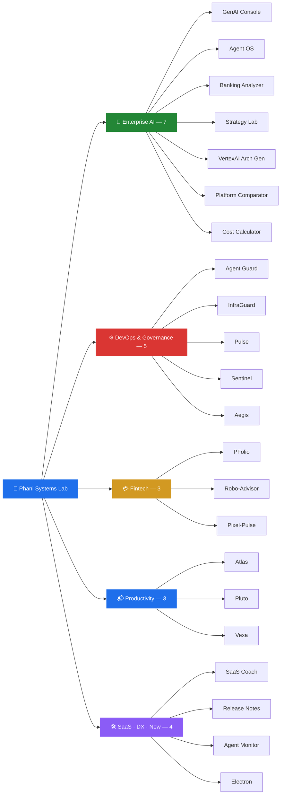

<!-- LAST_UPDATED: 2026-03-16T04:00:00Z -->
<!-- Stats auto-refresh via cache_seconds=1800 — no manual re-deployment needed -->
<!-- Activity graph, streak stats & contribution cards update automatically on every commit -->

# Phani Marupaka

#### 0→1 AI Product Builder &nbsp;·&nbsp; Enterprise Systems Architect &nbsp;·&nbsp; GTM Strategist

**14+ years** shipping products across consulting, enterprise sales & engineering. 
I build production-grade AI systems, take them to market, and open-source everything.

**22 open-source projects** &nbsp;·&nbsp; **6 interconnected AI platforms** &nbsp;·&nbsp; **Full-stack, end-to-end**

&nbsp;
&nbsp;
&nbsp;
&nbsp;

&nbsp;

&nbsp;

---

### ⭐ Flagship Systems

<table>
<tr>
<td width="50%" valign="top">

**🎛 [Enterprise GenAI Console](https://github.com/Phani3108/Enterprise-GenAI-Console)**

Google-Labs-style AI strategy system — 5 specialized agents evaluate platform, architecture, cost, readiness & launch strategy for GenAI in banking. Scenario studio, counterfactual simulator, export-ready decision briefs.

| Agent Repo | Role |
|:-----------|:-----|
| [VertexAI Architecture Generator](https://github.com/Phani3108/VertexAIArchitectureGenerator) | 🏗 Architecture blueprints |
| [AI Platform Comparator](https://github.com/Phani3108/AIPlatformComparator) | 🔍 Platform evaluation |
| [GenAI Cost Calculator](https://github.com/Phani3108/GenAICostCalulator) | 💰 Cost estimation |
| [Enterprise AI Analyzer — Banking](https://github.com/Phani3108/Enterprise-AI-Analyzer---Banking) | 📊 Readiness assessment |
| [AI Product Strategy Lab](https://github.com/Phani3108/AI-Product-Strategy-Lab---Financial-Institutions) | 🚀 GTM strategy |

</td>
<td width="50%" valign="top">

**🧠 [Enterprise Agent OS](https://github.com/Phani3108/Enterprise-Agent-OS)**

Full-stack AI Operating System — orchestration, governance, memory & observability for autonomous agent clusters. 12+ agents, DAG workflows, SOMAN marketing graph, 22 tool connectors.

**Key surfaces:** Command Center · Skill Marketplace · Workflow Builder · Agent Collaboration Protocol · Memory Graph · Control Plane · Observability · Governance Dashboard · Prompt Library · Execution Scheduler

</td>
</tr>
</table>

---

### 🌌 Full Systems Universe — 22 Projects

#### 🏢 Enterprise AI

| | Project | What it does | Stack |
|:-:|:--------|:-------------|:------|
| 🎛 | [**Enterprise GenAI Console**](https://github.com/Phani3108/Enterprise-GenAI-Console) | Google-Labs-style decision system — 5 agents, scenario studio, counterfactual simulator | TypeScript, Next.js, Zustand, ReactFlow |
| 🧠 | [**Enterprise Agent OS**](https://github.com/Phani3108/Enterprise-Agent-OS) | Full-stack AI OS — 12+ agents, DAG workflows, SOMAN marketing graph, 22 connectors | TypeScript, Next.js, LangGraph, PostgreSQL |
| 📊 | [**Enterprise AI Analyzer — Banking**](https://github.com/Phani3108/Enterprise-AI-Analyzer---Banking) | Evaluate AI maturity and deployment risks for financial institutions | TypeScript, Next.js |
| 🚀 | [**AI Product Strategy Lab**](https://github.com/Phani3108/AI-Product-Strategy-Lab---Financial-Institutions) | Design, evaluate & launch AI products for banking — structured strategy lab | TypeScript, Next.js |
| 🏗 | [**VertexAI Architecture Generator**](https://github.com/Phani3108/VertexAIArchitectureGenerator) | Production-grade Vertex AI architectures — diagrams, blueprints, security plans, cost estimates | TypeScript, Next.js, Mermaid, SQLite |
| 🔍 | [**AI Platform Comparator**](https://github.com/Phani3108/AIPlatformComparator) | Compare Vertex AI vs Azure OpenAI vs Bedrock — 5 evaluation engines, scoring, lock-in analysis | TypeScript, Next.js |
| 💰 | [**GenAI Cost Calculator**](https://github.com/Phani3108/GenAICostCalulator) | Estimate infrastructure, model & RAG costs before deploying enterprise AI | TypeScript, Next.js |

#### ⚙️ DevOps & Governance

| | Project | What it does | Stack |
|:-:|:--------|:-------------|:------|
| 🚨 | [**Agent Guard**](https://github.com/Phani3108/Agent-Guard) | AI control layer — triages incidents, routes decisions, triggers auto-remediation | Python |
| 🛡 | [**InfraGuard**](https://github.com/Phani3108/InfraGuard) | Detects drift, latency spikes & hidden infrastructure fragility | Python |
| 📡 | [**Pulse**](https://github.com/Phani3108/Pulse) | Turns raw logs & telemetry into early warning signals with anomaly detection | TypeScript |
| 🔒 | [**Sentinel**](https://github.com/Phani3108/Sentinel) | Real-time compliance monitoring — policy engines, audit trails, AI reasoning | TypeScript |
| 🔐 | [**Aegis**](https://github.com/Phani3108/Aegis) | API governance — schema validation, policy enforcement, cross-service contract safety | TypeScript |

#### 💳 Fintech

| | Project | What it does | Stack |
|:-:|:--------|:-------------|:------|
| 💰 | [**PFolio**](https://github.com/Phani3108/PFolio) | Unifies assets, liabilities & cash flow across countries — true net worth | TypeScript |
| 🤖 | [**Robo-Advisor**](https://github.com/Phani3108/Robo-Advisor) | Builds, monitors & rebalances investment portfolios intelligently | Python |
| 💳 | [**Pixel-Pulse**](https://github.com/Phani3108/Pixel-Pulse) | Card issuer engagement — behavioral signals trigger smarter rewards | JavaScript |

#### 📬 Productivity & Communication

| | Project | What it does | Stack |
|:-:|:--------|:-------------|:------|
| 📞 | [**Atlas**](https://github.com/Phani3108/Atlas) | AI call assistant — answers calls autonomously, delivers structured summaries | TypeScript |
| 📬 | [**Pluto**](https://github.com/Phani3108/Pluto) | Email intelligence — converts inbox chaos into prioritized decisions & tracked actions | TypeScript |
| 📱 | [**Vexa**](https://github.com/Phani3108/Vexa) | AI call screening — handles spam, insurance pitches & unknown calls with live transcripts | TypeScript |

#### 🛠 SaaS, DX & Experimental

| | Project | What it does | Stack |
|:-:|:--------|:-------------|:------|
| 📈 | [**SaaS Coach**](https://github.com/Phani3108/SaaS-Coach) | Surfaces churn & growth levers — integrates CRM, usage analytics, retention modeling | Python |
| 📝 | [**Release Notes Composer**](https://github.com/Phani3108/Release-Notes-Composer) | Auto-generates structured, audience-ready release notes from raw commits | JavaScript |
| 🔬 | [**Agent-Monitor-Qualifier**](https://github.com/Phani3108/Agent-Monitor-Qualifier) | Agent quality monitoring and evaluation framework | Python |
| ⚡ | [**Electron**](https://github.com/Phani3108/Electron) | New project — in development | JavaScript |

---

### 📅 Contribution Timeline

> All contributions since account creation. Every commit — including AI-assisted and system-generated — is authored under this account.

| Date | Activity | Details |
|:-----|:---------|:--------|
| **Feb 1** | 🚀 Joined GitHub + 12 repos created | Aegis, Atlas, Pulse, Sentinel, Pluto, Pixel-Pulse, Robo-Advisor, InfraGuard, SaaS-Coach, Release-Notes-Composer, Agent-Guard, Agent-Monitor-Qualifier — all with initial codebases |
| **Feb 20** | 📱 Created Vexa | AI call assistant with spam handling, multi-language support, live transcription |
| **Mar 3** | 🔧 Vexa development | 2 commits — major feature additions to call screening engine |
| **Mar 4** | 💰🔍 Created GenAI Cost Calculator + AI Platform Comparator | 2 new repos + 3 commits — initial evaluation engines and cost modeling |
| **Mar 5** | 🏗 Massive build day — 4 repos + 9 commits | Created VertexAI Architecture Generator, Enterprise AI Analyzer — Banking, AI Product Strategy Lab, Enterprise GenAI Console — full flagship suite shipped |
| **Mar 6** | 📄 Profile README created | Phani3108 profile repo initialized |
| **Mar 7** | ✏️ Profile updates | 2 commits — README structure and content refinement |
| **Mar 9** | 🧠 Enterprise Agent OS + mass update — 23 commits | Created EAOS with full agent orchestration. Pushed updates across all 20+ repos — descriptions, READMEs, code refinements. Made Vexa and EAOS public |
| **Mar 10** | 🔄 EAOS development | 2 commits — initial platform architecture, agent coordination layer |
| **Mar 11** | 🔄 EAOS development | 2 commits — skill marketplace, workflow engine foundations |
| **Mar 12** | 🔄 EAOS development | 3 commits — DAG workflows, tool connector framework |
| **Mar 13** | ✏️ Profile README overhaul | 3 commits — complete README restructure with mermaid diagrams |
| **Mar 14** | 🔄 EAOS development | 5 commits — SOMAN marketing agent graph, governance dashboard, tool connectors |
| **Mar 15** | 🔄 EAOS development | 5 commits — observability layer, memory graph, control plane refinements |
| **Mar 16** | ⚡ Created Electron + README overhaul | New project repository initialized, profile README fully restructured |

<b>Total: 50+ contributions</b> across 22 projects since Feb 1, 2026

<!-- Activity graph updates automatically with every new commit -->

---

### 📊 Stats & Stack

<!-- Stats use cache_seconds=1800 for 30-min refresh — updates automatically, no re-deploy needed -->

&nbsp;&nbsp;

---

© 2026 <a href="https://linkedin.com/in/phani-marupaka"><b>Phani Marupaka</b></a>. All rights reserved. All projects contain embedded provenance markers protected under 17 U.S.C. § 1202.

