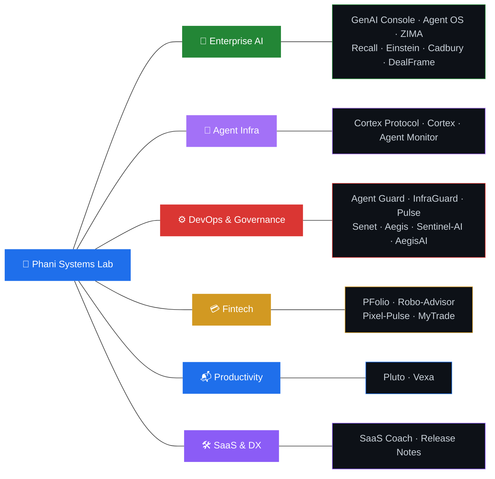

<!-- LAST_UPDATED: 2026-04-12T18:36:42Z -->
<!-- Keywords: AI agent, multi-agent system, LLM orchestration, enterprise AI, agentic workflow, LangGraph, LangChain, Semantic Kernel, AutoGen, CrewAI, Pinecone, Cosmos DB, Azure OpenAI, RAG, vector search -->

# Phani Marupaka

#### AI Systems Engineer · Multi-Agent Architect · Open-Source Builder

**14+ years** across consulting, enterprise sales & full-stack engineering. 
I build **production-grade AI agent systems**, ship them to market, and open-source everything.

**30 open-source projects** · **8 interconnected AI platforms** · **Full-stack, end-to-end**

---

&nbsp;
&nbsp;
&nbsp;
&nbsp;

 

&nbsp;

&nbsp;

---

### 🧰 Tech Stack & AI Toolchain

**Languages & Frameworks**

**Infrastructure & Data**

**AI / ML / Agent Frameworks**

**Vector DBs & Storage**

**AI-Assisted Development**

---

### ⭐ Flagship Platforms

<table>
<tr>
<td width="50%" valign="top">

**🧠 [Enterprise Agent OS](https://github.com/Phani3108/Enterprise-Agent-OS)** &nbsp; 

Full-stack AI Operating System — orchestrates **53 autonomous agents** across 5 regiments with military-grade hierarchy. DAG workflows, SOMAN marketing graph, 150+ API routes, 22 tool connectors.

`TypeScript` `Next.js` `LangGraph` `AutoGen` `CrewAI` `PostgreSQL`

**Surfaces:** Command Center · Skill Marketplace · Workflow Builder · Memory Graph · Governance Dashboard · Budget Intelligence · Innovation Labs

</td>
<td width="50%" valign="top">

**🎛 [Enterprise GenAI Console](https://github.com/Phani3108/Enterprise-GenAI-Console)** &nbsp; 

Google-Labs-style AI strategy console — **5 specialized agents** evaluate platform, architecture, cost, readiness & GTM for GenAI adoption in banking.

`TypeScript` `Next.js` `Zustand` `ReactFlow` `Vertex AI`

| Sub-system | Role |
|:-----------|:-----|
| [VertexAI Architecture Generator](https://github.com/Phani3108/VertexAIArchitectureGenerator) | 🏗 Architecture blueprints |
| [AI Platform Comparator](https://github.com/Phani3108/AIPlatformComparator) | 🔍 Platform evaluation |
| [GenAI Cost Calculator](https://github.com/Phani3108/GenAICostCalulator) | 💰 Cost estimation |
| [Enterprise AI Analyzer](https://github.com/Phani3108/Enterprise-AI-Analyzer---Banking) | 📊 Readiness assessment |
| [AI Product Strategy Lab](https://github.com/Phani3108/AI-Product-Strategy-Lab---Financial-Institutions) | 🚀 GTM strategy |

</td>
</tr>
<tr>
<td width="50%" valign="top">

**🏭 [ZIMA — AI Marketing Agency](https://github.com/Phani3108/ZIMA)**

Autonomous marketing agency — **13 agents across 5 departments**, actor-critic reflection loops, LangGraph state machine with 14+ nodes, A2A protocol, dual-track learning engine. Azure-ready with toggleable backends.

`Python` `FastAPI` `LangGraph` `Azure OpenAI` `Claude` `Gemini` `Cosmos DB` `Qdrant` `Redis` `Next.js` `Teams Bot`

</td>
<td width="50%" valign="top">

**🔬 [Cortex Protocol](https://github.com/Phani3108/Turing-Cortex-Agent-Protocol)**

Governance layer for enterprise AI agents — define once, enforce everywhere, audit everything. Compiles to **6 frameworks**: OpenAI SDK, Claude SDK, LangGraph, CrewAI, Semantic Kernel, system prompts. SOC2/HIPAA/PCI-DSS compliance reporting.

`Python` `LangChain` `LangGraph` `Semantic Kernel` `OpenAI SDK` `FastAPI`

</td>
</tr>
</table>

---

### 🌌 Full Project Universe — 30 Open-Source Repos

#### 🏢 Enterprise AI & Multi-Agent Platforms

| | Project | What it does | Tech |
|:-:|:--------|:-------------|:-----|
| 🔮 | [**Recall**](https://github.com/Phani3108/Recall) | AI-native Work OS — Ask (RAG chat), Pilot (delegation agent), Flow (task engine) | Python, FastAPI, Next.js, Weaviate, LiteLLM, PostgreSQL |
| 🧬 | [**Einstein**](https://github.com/Phani3108/Einstein) | Personal semantic engine — transforms scattered notes into a searchable knowledge base | Python, FastAPI, Pinecone, OpenAI, PostgreSQL |
| 🤖 | [**Cadbury**](https://github.com/Phani3108/Cadbury) | Consumer AI delegation layer — specialized delegates for distinct life domains | TypeScript, Next.js |
| 🎯 | [**DealFrame**](https://github.com/Phani3108/dealframe) | Video → negotiation intelligence — turns calls & demos into machine-readable intel | Python |

#### 🤖 Agent Infrastructure & Protocols

| | Project | What it does | Tech |
|:-:|:--------|:-------------|:-----|
| 🔬 | [**Cortex Protocol**](https://github.com/Phani3108/Turing-Cortex-Agent-Protocol) | Agent governance layer — define once, compile to 6 runtimes, enforce everywhere | Python, LangChain, LangGraph, Semantic Kernel |
| ⚙️ | [**Cortex**](https://github.com/Phani3108/Cortex) | Universal context engine — one config compiles into native files for 9 AI coding tools | JavaScript |
| 🔬 | [**Agent-Monitor-Qualifier**](https://github.com/Phani3108/Agent-Monitor-Qualifier) | CI/CD quality gate for AI agents — validates correctness, safety, determinism | Python |

#### ⚙️ DevOps, Security & Governance

| | Project | What it does | Tech |
|:-:|:--------|:-------------|:-----|
| 🚨 | [**Agent Guard**](https://github.com/Phani3108/Agent-Guard) | AI control layer — triages incidents, routes decisions, triggers auto-remediation | Python |
| 📡 | [**Pulse**](https://github.com/Phani3108/Pulse) | Turns raw logs & telemetry into early warning signals with anomaly detection | TypeScript |
| 🛡 | [**Senet**](https://github.com/Phani3108/Senet) | Real-time compliance monitoring — policy engines, audit trails, AI guardrails | TypeScript |
| 👁 | [**Sentinel-AI**](https://github.com/Phani3108/Sentinel-AI) | Fully local multimodal inference — Images & video → Vision Model → LLM → RAG | Python |

#### 💳 Fintech & Investment

| | Project | What it does | Tech |
|:-:|:--------|:-------------|:-----|
| 💰 | [**PFolio**](https://github.com/Phani3108/PFolio) | Personal finance — unifies assets, liabilities & cash flow across countries | TypeScript |
| 📊 | [**MyTrade**](https://github.com/Phani3108/MyTrade) | Multi-agent LLM trading engine — analysts, researchers, risk managers, portfolio optimizer | Python |
| 🤖 | [**Robo-Advisor**](https://github.com/Phani3108/Robo-Advisor) | Builds, monitors & rebalances investment portfolios intelligently | Python |
| 💳 | [**Pixel-Pulse**](https://github.com/Phani3108/Pixel-Pulse) | Card issuer engagement — behavioral signals trigger smarter rewards | JavaScript |

#### 📬 Productivity & Communication

| | Project | What it does | Tech |
|:-:|:--------|:-------------|:-----|
| 📬 | [**Pluto**](https://github.com/Phani3108/Pluto) | Email intelligence — converts inbox chaos into prioritized decisions & tracked actions | TypeScript |
| 📱 | [**Vexa**](https://github.com/Phani3108/Vexa) | AI call screening — handles spam & unknown calls with live transcripts | TypeScript |

#### 🛠 SaaS & Developer Experience

| | Project | What it does | Tech |
|:-:|:--------|:-------------|:-----|
| 📈 | [**SaaS Coach**](https://github.com/Phani3108/SaaS-Coach) | Surfaces churn & growth levers — integrates CRM, usage analytics, retention modeling | Python |
| 📝 | [**Release Notes Composer**](https://github.com/Phani3108/Release-Notes-Composer) | Auto-generates structured, audience-ready release notes from raw commits | JavaScript |

---

### 📈 GitHub Stats

&nbsp;&nbsp;

---

**If any of these projects are useful to you, a ⭐ goes a long way.**

---

© 2026 <a href="https://linkedin.com/in/phani-marupaka"><b>Phani Marupaka</b></a>. All rights reserved.

