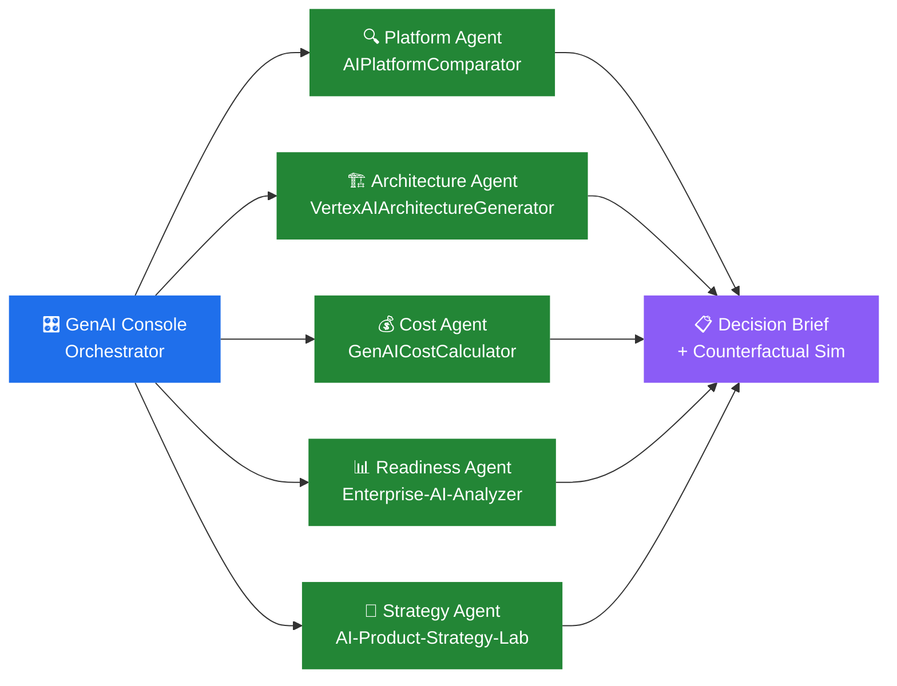
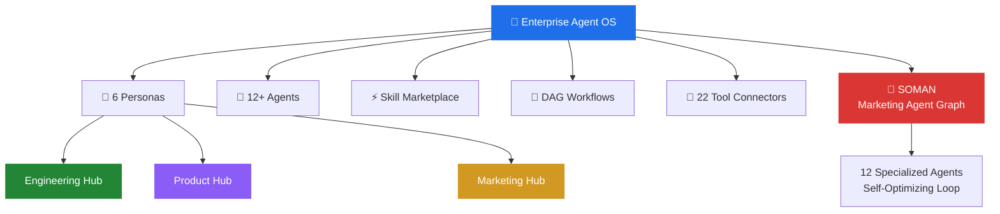
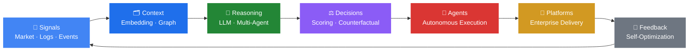

```mermaid
graph TD
    Lab["🧪 Phani Systems Lab<br/>21 Projects"] --> GCP["☁️ Google Cloud / Vertex AI"]
    Lab --> Enterprise["🏢 Enterprise AI"]
    Lab --> Ops["⚙️ DevOps Intelligence"]
    Lab --> Fin["💳 Fintech"]
    Lab --> SaaS["📈 SaaS"]
    Lab --> Gov["🔐 Governance & Compliance"]
    Lab --> Productivity["📬 Productivity AI"]
    Lab --> DX["🛠 Developer Experience"]

    GCP --> GCP1["VertexAI Architecture Generator"]
    GCP --> GCP2["AI Platform Comparator"]
    GCP --> GCP3["GenAI Cost Calculator"]

    Enterprise --> E1["Enterprise GenAI Console"]
    Enterprise --> E2["Enterprise Agent OS"]
    Enterprise --> E3["Enterprise AI Analyzer — Banking"]
    Enterprise --> E4["AI Product Strategy Lab"]

    Ops --> O1["Agent Guard — Incident Triage"]
    Ops --> O2["InfraGuard — Infra Risk"]
    Ops --> O3["Pulse — Anomaly Detection"]
    Ops --> O4["Sentinel — Compliance Monitor"]

    Fin --> F1["PFolio — Net Worth Tracker"]
    Fin --> F2["Robo-Advisor — Portfolio AI"]
    Fin --> F3["Pixel-Pulse — Card Engagement"]

    SaaS --> S1["SaaS Coach — Growth Intelligence"]

    Gov --> G1["Aegis — API Governance"]

    Productivity --> P1["Atlas — AI Call Assistant"]
    Productivity --> P2["Pluto — Email Intelligence"]

    DX --> D1["Release Notes Composer"]

    style Lab fill:#1f6feb,stroke:none,color:#fff
    style GCP fill:#4285F4,stroke:none,color:#fff
    style Enterprise fill:#238636,stroke:none,color:#fff
    style Ops fill:#da3633,stroke:none,color:#fff
    style Fin fill:#d29922,stroke:none,color:#fff
    style SaaS fill:#8b5cf6,stroke:none,color:#fff
    style Gov fill:#238636,stroke:none,color:#fff
    style Productivity fill:#1f6feb,stroke:none,color:#fff
    style DX fill:#6e7681,stroke:none,color:#fff
```

<!-- LAST_UPDATED: 2026-03-14T01:19:36Z -->

# Phani Marupaka

### **0→1 AI Product Builder &nbsp;·&nbsp; Enterprise Systems Architect &nbsp;·&nbsp; GTM Strategist**

**14+ years** shipping products across consulting, enterprise sales & engineering. 
I build production-grade AI systems, take them to market, and open-source everything.

**21 open-source projects** &nbsp;·&nbsp; **6 interconnected AI platforms** &nbsp;·&nbsp; **Full-stack, end-to-end**

 

&nbsp;
&nbsp;
&nbsp;
&nbsp;

 

&nbsp;

&nbsp;

---

<h2 align="center">🧠 What I Do</h2>

<table align="center">
<tr>
<td width="33%" align="center"><h3>🚀 0→1 Products</h3>
Conceive, architect, build, and ship AI products from scratch. Every repo here is a working system — not a tutorial.
</td>
<td width="33%" align="center"><h3>🤖 AI + Engineering</h3>
Multi-agent systems, LLM orchestration, Vertex AI, RAG pipelines, real-time observability — at enterprise scale.
</td>
<td width="33%" align="center"><h3>📈 Sales + GTM</h3>
14 years in consulting & enterprise sales. I understand how products get adopted — positioning, pricing, launch strategy.
</td>
</tr>
</table>

---

<h2 align="center">⭐ Flagship: Enterprise GenAI Console</h2>
<h4 align="center">A Google-Labs-style AI strategy system — 6 repos, 5 autonomous agents, 1 decision brief</h4>

<i>One banking scenario → five specialized AI agents → executive decision brief + export pack</i>

| Repo | Role | What it does |
|:-----|:-----|:-------------|
| [**Enterprise-GenAI-Console**](https://github.com/Phani3108/Enterprise-GenAI-Console) | 🎛 Orchestrator | Console shell that coordinates 5 agents, scenario studio, counterfactual simulator, experiment timeline |
| [**VertexAIArchitectureGenerator**](https://github.com/Phani3108/VertexAIArchitectureGenerator) | 🏗 Architecture Agent | Generates production-grade Vertex AI architectures with Mermaid diagrams, blueprints, security & observability plans |
| [**AIPlatformComparator**](https://github.com/Phani3108/AIPlatformComparator) | 🔍 Platform Agent | Compares Vertex AI vs Azure OpenAI vs AWS Bedrock — 5 evaluation engines, scoring, vendor lock-in analysis |
| [**GenAICostCalulator**](https://github.com/Phani3108/GenAICostCalulator) | 💰 Cost Agent | Estimates infrastructure, model, and RAG costs before deploying enterprise AI systems |
| [**Enterprise-AI-Analyzer---Banking**](https://github.com/Phani3108/Enterprise-AI-Analyzer---Banking) | 📊 Readiness Agent | Evaluates AI maturity, model deployment risks, generates strategic adoption roadmaps for banks |
| [**AI-Product-Strategy-Lab**](https://github.com/Phani3108/AI-Product-Strategy-Lab---Financial-Institutions) | 🚀 Strategy Agent | Designs GTM strategy, competitive positioning, and launch plans for AI in financial institutions |

> **Why this matters for Vertex AI:** This suite directly evaluates Google Cloud's Vertex AI against competitors across architecture, cost, platform fit, and enterprise readiness — with real market signals, evidence panels, and counterfactual "what-if" simulations.

---

<h2 align="center">🏢 Enterprise Agent OS</h2>
<h4 align="center">Full-stack AI Operating System — Orchestration, governance, memory & observability for autonomous agent clusters</h4>

**Key surfaces:** Command Center · Skill Marketplace · Skill Builder · Workflow Builder (DAG) · Agent Collaboration Protocol · Memory Graph · Control Plane · Observability · Governance Dashboard · Prompt Library · Knowledge Explorer · AI Learning Hub · Execution Scheduler

---

<h2 align="center">🌌 Full Systems Universe — 21 Repos</h2>

---

### 🧩 All Projects

#### ☁️ Google Cloud / Vertex AI

| | Project | What it does | Stack |
|:-:|:--------|:-------------|:------|
| 🏗 | [**VertexAI Architecture Generator**](https://github.com/Phani3108/VertexAIArchitectureGenerator) | Generate production-grade Vertex AI architectures — diagrams, blueprints, security plans, cost estimates, market signals | TypeScript, Next.js, Mermaid, SQLite |
| 🔍 | [**AI Platform Comparator**](https://github.com/Phani3108/AIPlatformComparator) | Compare Vertex AI vs Azure OpenAI vs Bedrock — 5 evaluation engines, scoring, lock-in analysis | TypeScript, Next.js |
| 💰 | [**GenAI Cost Calculator**](https://github.com/Phani3108/GenAICostCalulator) | Estimate infrastructure, model & RAG costs before deploying enterprise AI | TypeScript, Next.js |

#### 🏢 Enterprise AI

| | Project | What it does | Stack |
|:-:|:--------|:-------------|:------|
| 🎛 | [**Enterprise GenAI Console**](https://github.com/Phani3108/Enterprise-GenAI-Console) | Google-Labs-style decision system — 5 agents, scenario studio, counterfactual simulator | TypeScript, Next.js, Zustand, ReactFlow |
| 🧠 | [**Enterprise Agent OS**](https://github.com/Phani3108/Enterprise-Agent-OS) | Full-stack AI OS — 12+ agents, DAG workflows, SOMAN marketing graph, 22 connectors | TypeScript, Next.js, LangGraph, PostgreSQL |
| 📊 | [**Enterprise AI Analyzer — Banking**](https://github.com/Phani3108/Enterprise-AI-Analyzer---Banking) | Evaluate AI maturity and deployment risks for financial institutions | TypeScript, Next.js |
| 🚀 | [**AI Product Strategy Lab**](https://github.com/Phani3108/AI-Product-Strategy-Lab---Financial-Institutions) | Design, evaluate & launch AI products for banking — structured strategy lab | TypeScript, Next.js |

#### ⚙️ DevOps Intelligence

| | Project | What it does | Stack |
|:-:|:--------|:-------------|:------|
| 🚨 | [**Agent Guard**](https://github.com/Phani3108/Agent-Guard) | AI control layer — triages incidents, routes decisions, triggers auto-remediation | Python |
| 🛡 | [**InfraGuard**](https://github.com/Phani3108/InfraGuard) | Detects drift, latency spikes & hidden infrastructure fragility | Python |
| 📡 | [**Pulse**](https://github.com/Phani3108/Pulse) | Turns raw logs & telemetry into early warning signals with anomaly detection | TypeScript |
| 🔒 | [**Sentinel**](https://github.com/Phani3108/Sentinel) | Real-time compliance monitoring — policy engines, audit trails, AI reasoning | TypeScript |

#### 💳 Fintech

| | Project | What it does | Stack |
|:-:|:--------|:-------------|:------|
| 💰 | [**PFolio**](https://github.com/Phani3108/PFolio) | Unifies assets, liabilities & cash flow across countries — true net worth | TypeScript |
| 🤖 | [**Robo-Advisor**](https://github.com/Phani3108/Robo-Advisor) | Builds, monitors & rebalances investment portfolios intelligently | Python |
| 💳 | [**Pixel-Pulse**](https://github.com/Phani3108/Pixel-Pulse) | Card issuer engagement — behavioral signals trigger smarter rewards | JavaScript |

#### 📈 SaaS & Growth

| | Project | What it does | Stack |
|:-:|:--------|:-------------|:------|
| 📈 | [**SaaS Coach**](https://github.com/Phani3108/SaaS-Coach) | Surfaces churn & growth levers — integrates CRM, usage analytics, retention modeling | Python |

#### 🔐 Governance & Productivity

| | Project | What it does | Stack |
|:-:|:--------|:-------------|:------|
| 🔐 | [**Aegis**](https://github.com/Phani3108/Aegis) | API governance — schema validation, policy enforcement, cross-service contract safety | TypeScript |
| 📞 | [**Atlas**](https://github.com/Phani3108/Atlas) | AI call assistant — answers calls autonomously, delivers structured summaries | TypeScript |
| 📬 | [**Pluto**](https://github.com/Phani3108/Pluto) | Email intelligence — converts inbox chaos into prioritized decisions & tracked actions | TypeScript |
| 📝 | [**Release Notes Composer**](https://github.com/Phani3108/Release-Notes-Composer) | Auto-generates structured, audience-ready release notes from raw commits | JavaScript |

---

### 🧠 How My Systems Think

---

### 🧪 Building Next

`AI Operating Officer` · `Autonomous DevOps Agents` · `Knowledge Graph Assistants` · `Fintech Intelligence Platform` · `AI-Native SaaS Analytics`

---

### ⚡ Stack

 

---

### 📊 GitHub Stats

&nbsp;&nbsp;

---

© 2026 <a href="https://linkedin.com/in/phani-marupaka"><b>Phani Marupaka</b></a>. All rights reserved. All projects contain embedded provenance markers protected under 17 U.S.C. § 1202.

